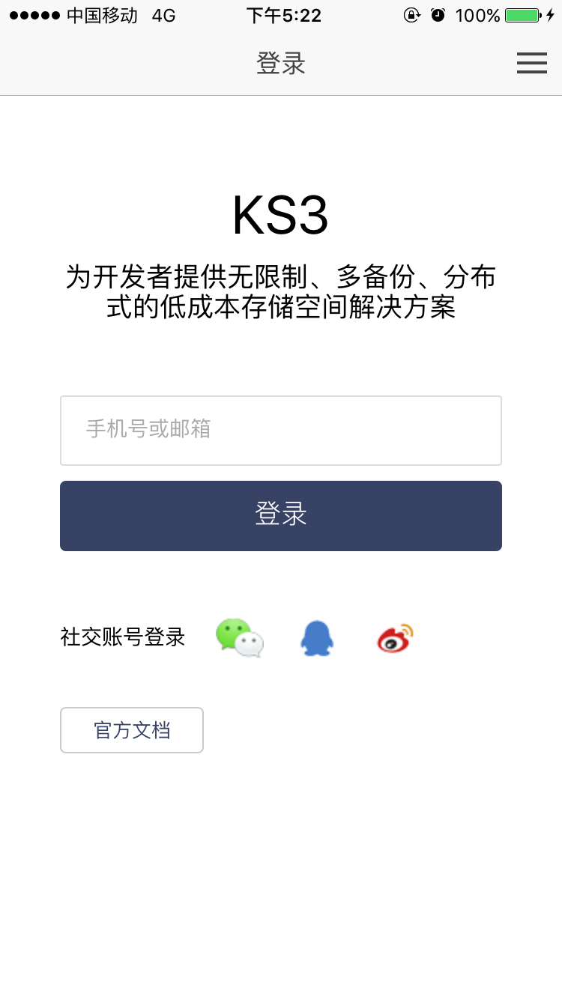
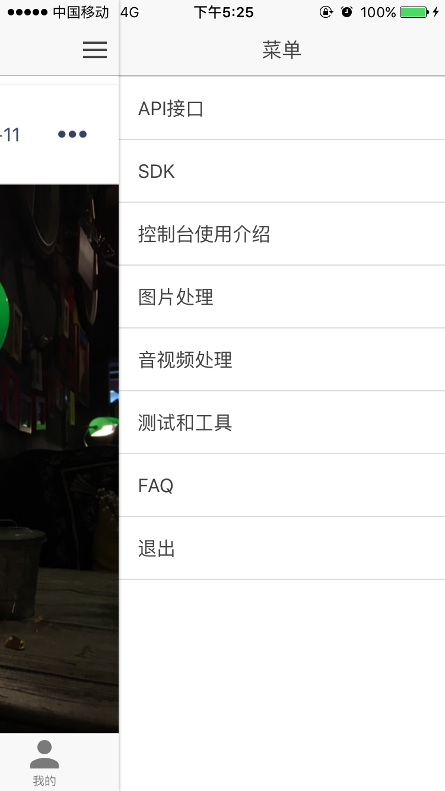
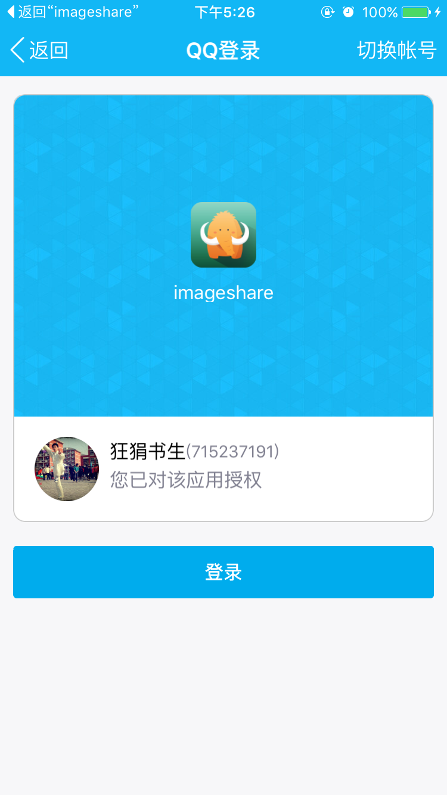
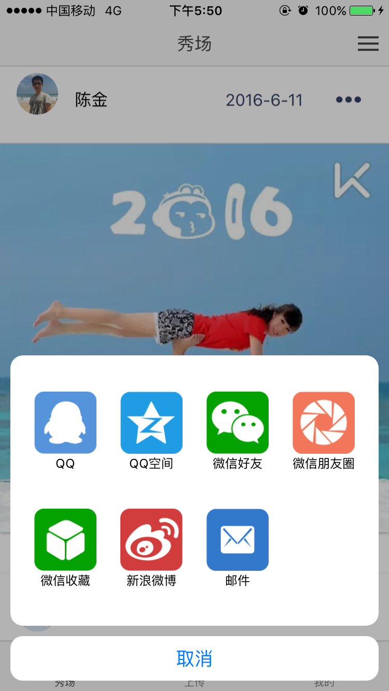

# ImageShare是一个基于ks3的图片分享应用


#### feature如下：

1. 用户登录（社交账号登录）
2. 上传照片（拍照上传，本地图片上传）
3. 首页展示所有用户上传的图片(向下滚动自动加载更多)
4. 个人页面按时间顺序展示本人上传的图片

#### 原型设计如下：


#### 本应用将演示如下Ks3接口的使用：

1. 通过账号下的AK, SK计算请求签名（后端签名）  [接口文档](http://ks3.ksyun.com/doc/api/index.html#请求签名)
2. PUT上传文件  [接口文档](http://ks3.ksyun.com/doc/api/object/put.html)
3. 上传回调处理      [接口文档](http://ks3.ksyun.com/doc/api/async/callback.html)


#### 架构说明
##### 1、整体架构

使用金山云存储服务时，很多人采用的做法是用户在浏览器/APP上传到应用服务器,然后应用服务器再把文件上传到KS3。
这种方法有三个缺点:

- 第一:上传慢,先上传到应用服务器,再上传到KS3,网络传送多了一倍。
- 第二:扩展性不好,如果后续用户多了,应用服务器会成为瓶颈。
- 第三:费用高,因为KS3上传流量是免费的。如果数据直传到KS3,不走应用服务器。那么将能省下应用服务器的流量费。

所以，我们建议采用服务端签名之后Web客户端直传文件的方案。（KS3用这个签名来对我们的应用进行身份识别认证）

Web端直传可以节省流量，但应用服务器无法知道用户上传的文件的地址（客户端经常需要从应用服务器获取所有文件的列表），所以需要KS3在获取到文件后回调用户应用服务器通知上传的文件的地址。
以便在用户应用服务器上维护上传文件的地址信息。这里使用KS3的上传回调处理接口（参见文档：http://ks3.ksyun.com/doc/api/async/callback.html）。
该操作是可选的，即如果应用服务器不需要知道上传文件的元数据，也可以不使用该接口。

这样，我们有了一个简单的方案，来实现可扩展的图片分享应用，架构如下图所示：


图中前端部分代码在工程中demo1/imageshare目录下，具体介绍参见[下一小节](#client)，应用服务器端采用node.js编写，代码在demo1/server.js中。

##### 2、<a id="client"></a>前端架构
本示例的前端采用流行的H5移动框架[Ionic](https://github.com/driftyco/ionic), 该框架允许基于开放的web技术构建跨平台的混合应用。Ionic框架是基于[Angular](https://github.com/angular/angular.js)和[Cordova](https://cordova.apache.org/)构建的，适合快速开发接近原生的混合应用。本教程的示例app ImageShare目前仅支持iOS系统，效果见如下app截图，您可以通过app store下载安装该app。



imageshare工程下的www目录中包含所有界面和逻辑的代码，plugins是应用依赖的插件，包括几个Cordova核心插件(相机，设备，文件传输，图片选择器，内嵌浏览器)和一个自定义的[ShareSDK插件](https://github.com/chenjin3/cordova-plugin-x-sharesdk)。platforms目录下所支持的平台，目前只支持iOS平台，想运行于其他平台可以通过ionic或[cordova的命令行工具](https://cordova.apache.org/docs/en/latest/reference/cordova-cli/index.html)自行添加其他平台（如Android，windows）。而platforms/ios/imageshare.xcodeproj 文件为xcode工程文件，可以通过xcode打开该iOS应用。


#### 核心代码说明
##### 1、从服务器端获取上传签名
客户端代码参见 imageshare/www/js/service.js中的Ks3Token服务。

```
/**
 * 获取Ks3的签名信息
 * @param objectKey
 * @param httpMethod  请求方法，如PUT，GET
 * @param contentType 实体mime类型，请求头不带Content-Type头时可以指定为""(空字符串)
 * @param headers x-kss-开头的请求头信息
 * 返回签名
 */
  .factory('Ks3Token', function($http , CONSTANT) {
    return {
      signature: function(objKey,httpMethod,contentType, headers) {
        return $http ({
            method: "POST",
            url: CONSTANT.serverHost + "index/token",
            data: {
              key: objKey,
              method: httpMethod,
              contentType: contentType,
              headers: headers
            },
            cache: true
          });
      }
    }
  })
```

PUT请求上传文件时获取签名的调用代码如下：

```
  var objKey = Ks3.encodeKey(CONSTANT.dir + user.uid + '/' + fileName);
  var contentType = 'image/jpg';
  var headers = {
              'x-kss-acl': 'public-read',
              'x-kss-callbackurl': 'http://0.0.0.0:3000',
              'x-kss-callbackbody': 'objectKey=${key}&createTime=${createTime}&uid=' + user.uid + '&nickname=' + encodeURIComponent(user.nickname) + '&icon=' + user.icon
  };
 Ks3Token.signature(objKey, 'PUT', contentType, headers).then(function (resp) {
      $scope.authorization = resp.data;
      ...
 });
```

说明：该PUT请求是一个上传回调处理请求，通过x-kss-callbackurl头部可以指定回调地址，通过
x-kss-callbackbody可以将一些自定义参数通过回调传递到应用服务器上，以便应用服务器记录已上传文件的url等元数据。接口文档参见：[上传回调处理](http://ks3.ksyun.com/doc/api/async/data.html)。

服务器端计算签名核心代码见imageshare/server.js中如下代码：

```
const auth = require('../node_modules/ks3/lib/auth');

handles.index.token = function calcToken(req, res) {
    if(req.body)  {
        var request = {
            uri: 'http://ks3-cn-beijing.ksyun.com/' + bucketName + '/' + req.body.key,
            method: req.body.method,
            date:'',
            body: '',
            type: req.body.contentType,
            headers: req.body.headers,
            resource: '/' + bucketName + '/' + req.body.key
        };

        var token = auth.generateAuth(ak, sk, request, '');
        res.writeHead(200);
        res.end(token);
    }else{
        res.writeHead(400);
        res.end('缺少参数');
    }
}
```

说明: 计算签名需要服务器端程序正确配置Ks3账号的AK，SK，这里依赖于ks3 Node.js SDK中的auth模块计算签名。


##### 2、PUT请求Web直传文件到Ks3

上传图片方法参见imageshare/www/js/controller.js中tabsCtrl的$scope.uploadimage方法。这里使用了Cordova的文件传输插件FileTransfer构造PUT请求上传图片。核心代码如下：

```
 $scope.uploadimage = function (fileURL, objKey, contentType, headers, authorization, prop) {
        var serverUrl = Ks3.config.protocol + '://' + Ks3.config.baseUrl + '/' + CONSTANT.bucket + '/' + objKey;
        var methodType = 'PUT';
        var options = new FileUploadOptions();
        var token = authorization || 'KSS ' + Ks3.config.AK + ':' + Ks3.generateToken(Ks3.config.SK, Ks3.config.bucket, objKey, methodType, contentType, headers, '');
        headers['Authorization'] = token;
        headers['Content-Type'] = contentType;
        options.headers = headers;
        options.httpMethod = methodType;

        var ft = new FileTransfer();
        ft.upload(fileURL, encodeURI(serverUrl), function (r) {
          console.log("Code = " + r.responseCode);
          console.log("Response = " + r.response);
          console.log("Sent = " + r.bytesSent);
        }, function (error) {
          alert("An error has occurred: Code = " + error.responseCode);
          console.log(JSON.stringify(error));
        }, options);
 }

```


##### 3、应用服务器处理Ks3回调通知
应用服务器需要提供接口接收Ks3的上传回调，记录已上传文件的元数据到本地数据库。ShareImage示例应用相关代码（server.js中）如下：

```
//接收ks3回调
handles.index.index = function(req,res,arg1,arg2) {
    //res.writeHead(200);
    //res.end(arg1 + arg2);
    try{
        if(req.body) {
            var objectKey = req.body.objectKey;
            var url = 'http://' + bucketName + '.ks3-cn-beijing.ksyun.com/' + objectKey;
            var createTime = req.body.createTime;
            var uid = req.body.uid;
            var nickname = decodeURIComponent(req.body.nickname);
            var icon = req.body.icon;
            var documentItem = {
                objectKey: objectKey,
                url: url,
                createTime :createTime,
                owner : {
                    uid: uid,
                    nickname: nickname,
                    icon: icon
                }
            };
            insertDocument2DB(documentItem, res);
        }else {
            processCallbackFailed(res);
        }
    }catch(e) {
        processCallbackFailed(res);
    }
}
```

这里将ks3回调传回来的object key，创建时间，用户id，昵称，头像等信息合成一条文档记录，存储
到mongoDB中。以便于在秀场和个人页面展示图片列表。